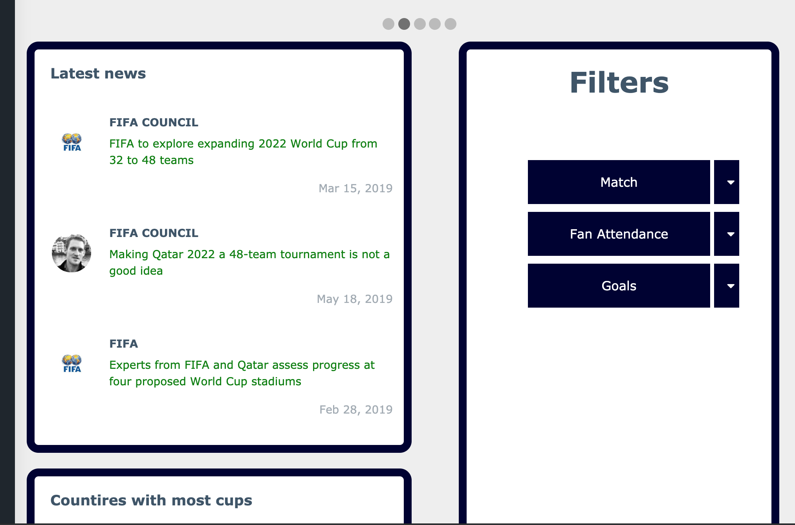
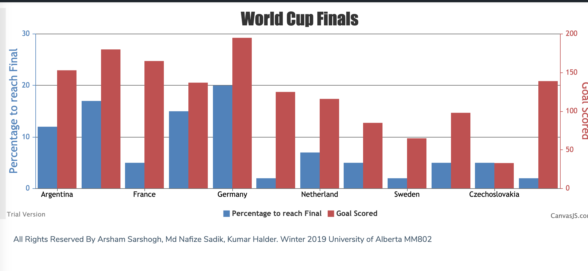

**FIFA statictic webpage containing all information till 2010**

This is a mini project for demostrating HTML,CSS,JS capabilities. This webpage is interactive system to filter data according to user's choice and visualise necessary data through graph.
Different types of graphs have been used for data visualisation. Data have been collected from kaggle free dataset containing information of 1956 to 2010. Some other interactive things are 
latest news syste and top countries to win the world cup. 

---

---

## Visualisation

Canvas.js have been used for data visualisation according to user's choice. The following types of charts are available for visualisation. 
1. Area chart
2. Bar chart.
3. Funnel chart. 
4. Box and whisker chart.
5. Line chart.
6. Waterfall chart.
7. Pie chart

---
Below are some demo for different charts. 

